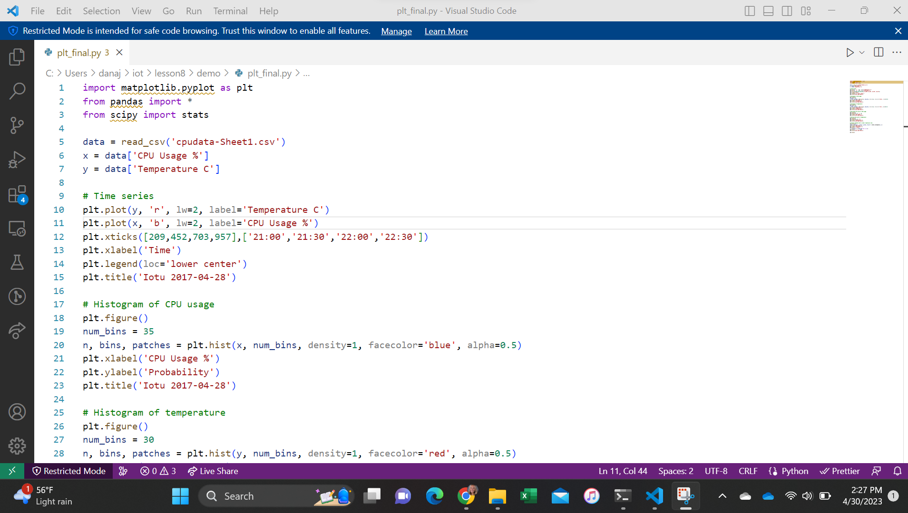
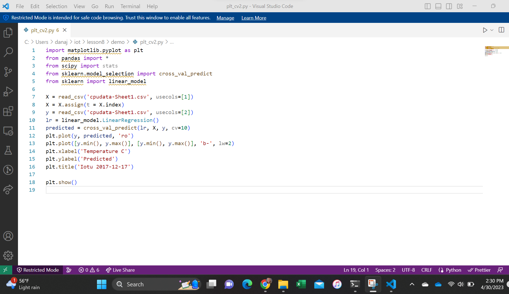
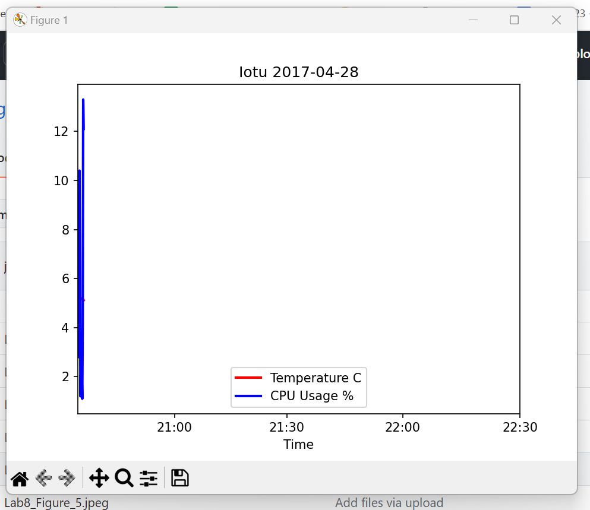
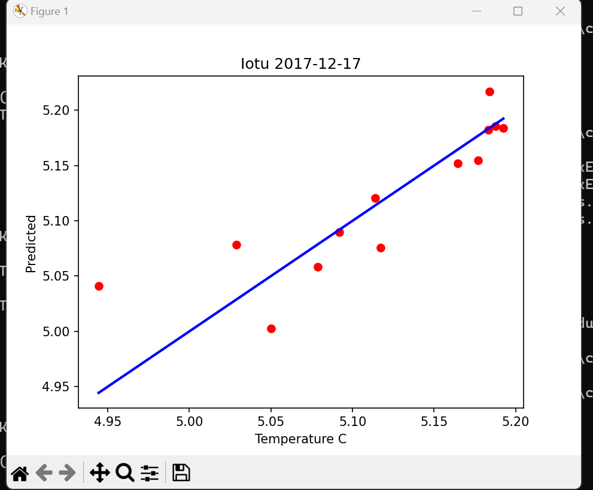
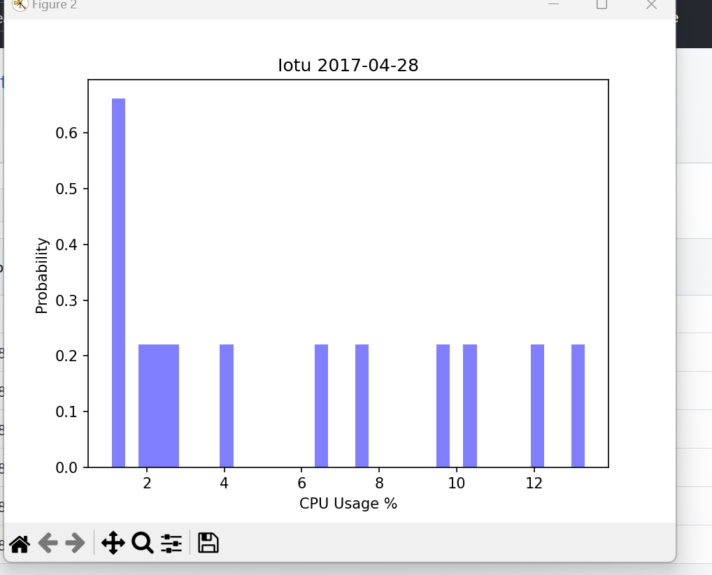
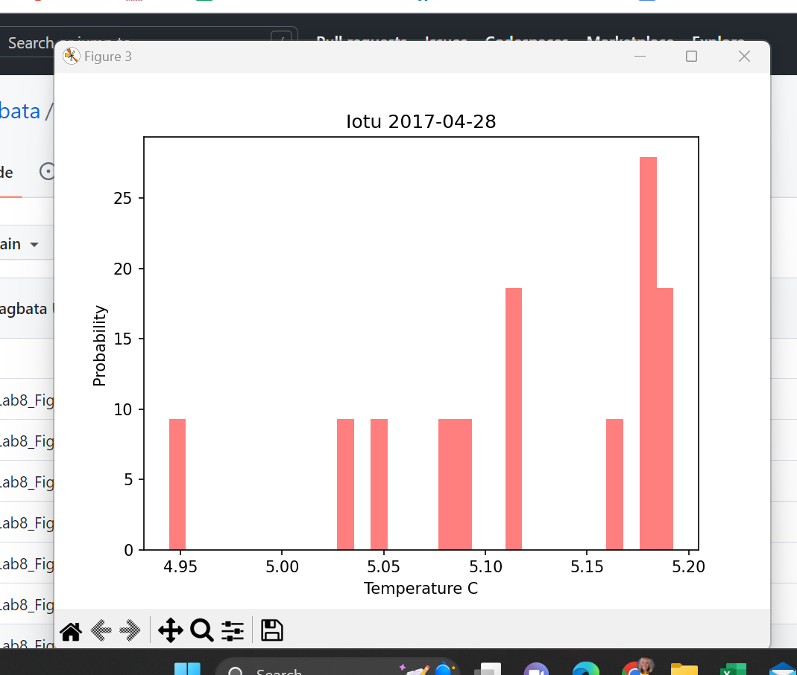
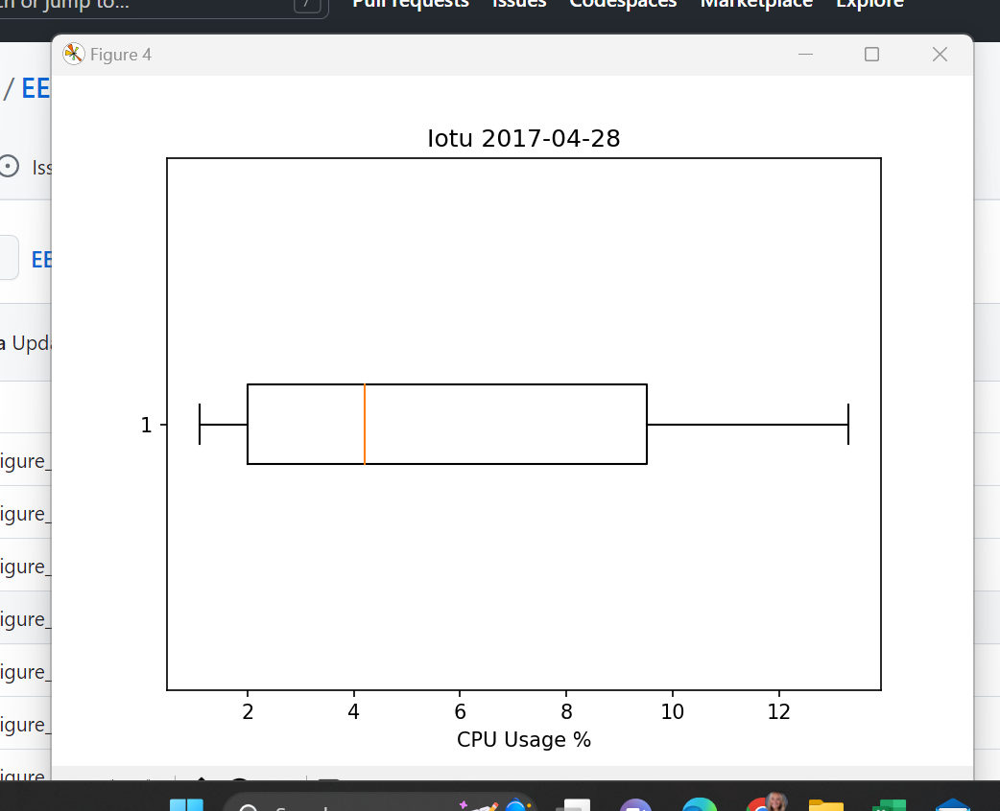
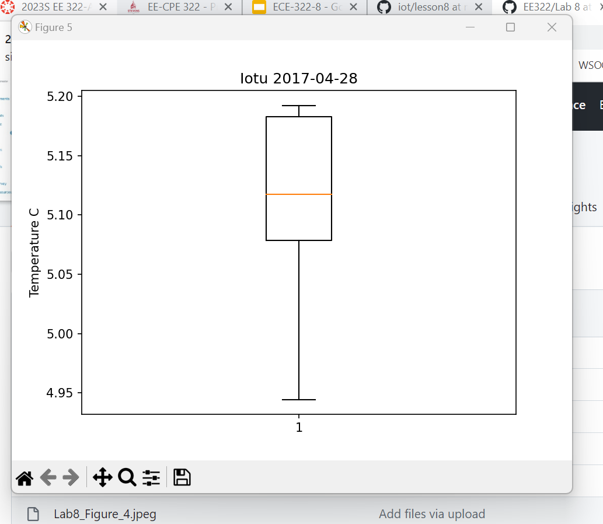
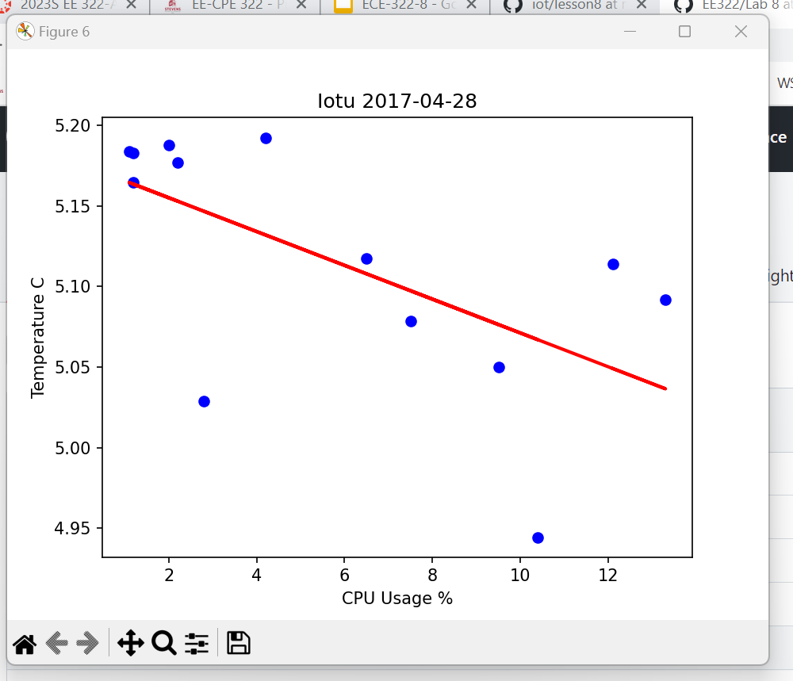

## Lab8: Data Analytics

First thing for Lab 8, I had to install all the proper python packages.

Then, I saved the Lab 7 Google sheet in CSV format to ~/demo and copied ~/iot/lesson8/plt_final.py and plt_cv2.py to ~/demo

Then, I edited plt_final.py and plt_cv2.py to read the CSV file with customized plot titles and ran plt_final.py and plt_cv2.py and got the following results:

