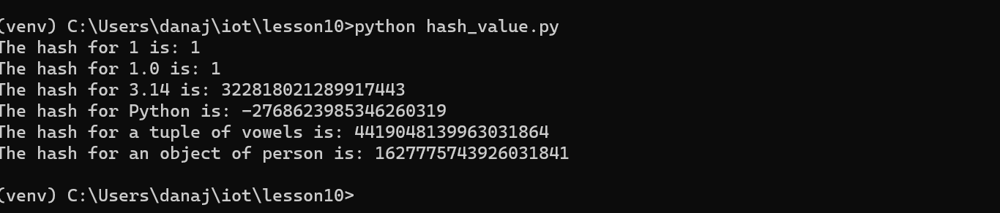
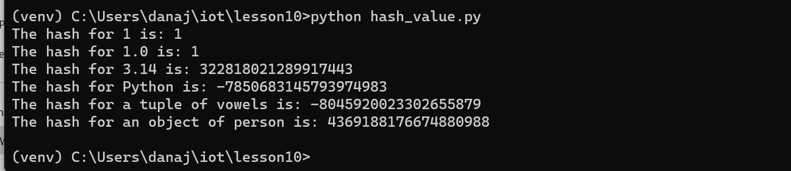
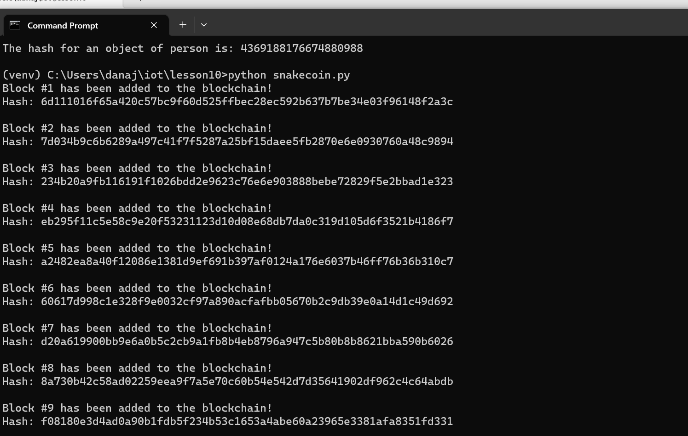
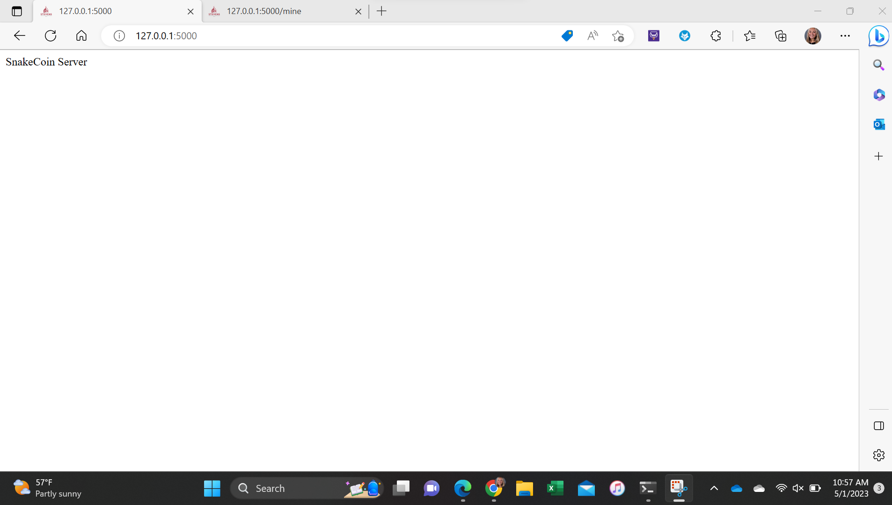
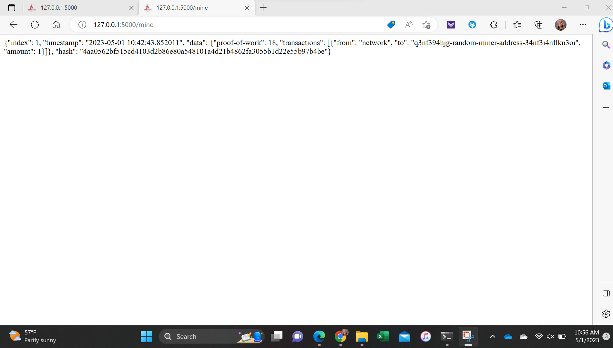
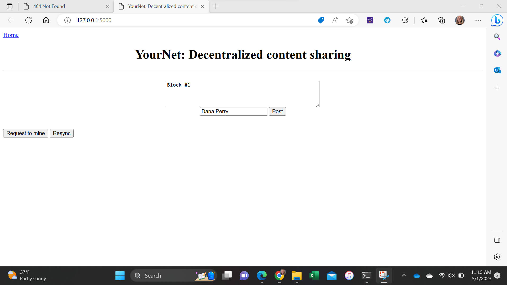
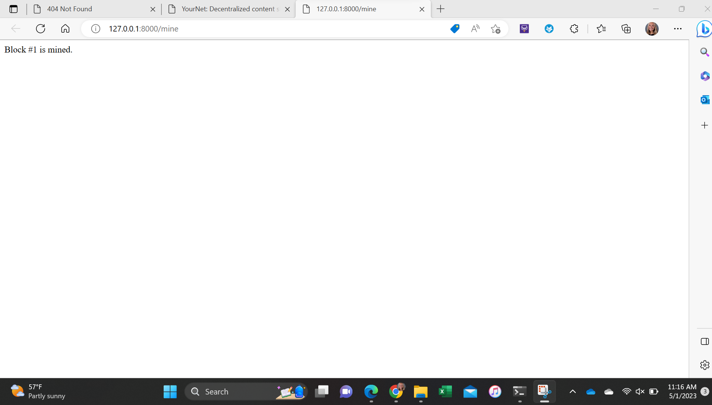
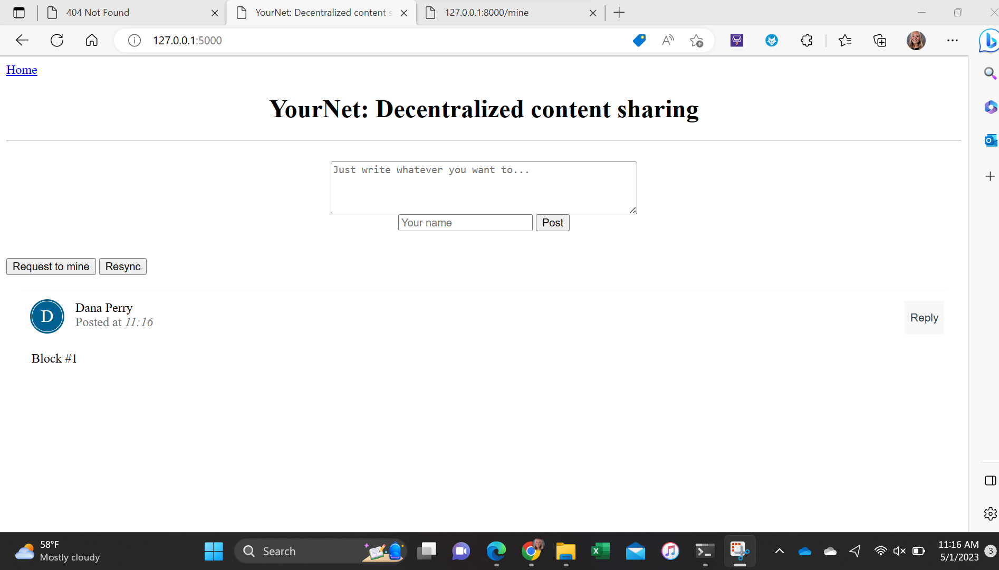

## Lab 10: Blockchain 

To start this lab I first ran hash_value.py twice and compared the results:

Then I ran snakecoin.py:

Next, I ran snakecoin-server-full-code.py on Terminal 1 andthen mined a new block on Terminal 2 and got the following results:

Finally, I cloned Python blockchain app and uncommented the last line of node_server.py and then I ran node_server.py on Terminal 1 and run_app.py on Terminal 2 and got the following results:

