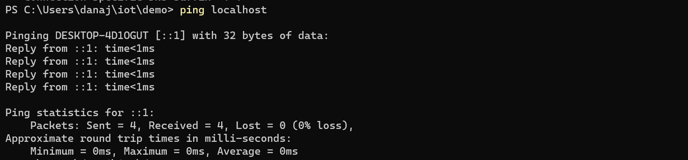

# Lab 2
### Command Explainations

$ hostname locates the hostname of the computer 

$ env prints all of the computer's system variables

$ ps lists the computers currently running processes and then their PIDS

$ pwd writes the full path name of my current directory to standard output

$ git clone https://github.com/kevinwlu/iot.git clones Professor's github repo into to my computer (note there is an error because I had already cloned this into my computer)

$ cd iot will move my computer into the "iot" directory 

$ ls lists all the folders and files wihthin the current directory 

$ cd then shows the current directory

$ df displays the info about the total and also available space on a file system

$ mkdir demo then creates a directory named "demo" (note there is an error because I had already created this directory onto my computer)

$ cd demo moves my computer back into the "demo" directory that was created

$ nano file creates a file named "file" and then you can edit the text in the file

$ cat file prints the content typed into the nano file "file"

$ cp file file1 copies "file" into a new file called "file1"

$ mv file file2 moves "file" into a new file called "file2"

$ rm  file2 removes "file2" from the directory

$ clear command clears the entre terminal window 

$ man uname is a Linux command (which is why there is not phot as I do not have Linux) that displays the user manual of the uname command
$ uname a- prints the operating system as well as the kernel name, system's node name, the kerne release, the kernel vision, and the achine hardware name (also a Linux command) 

$ ifconfig is also a Linux command (so I used ipconfig which is for windows) and it is used to assign an address network interface as well as configure/display the current network interface configuration information

$ ping localhost pings the local IP address of the local computer addresses 

$ netstat shows the network status and protocal stats

