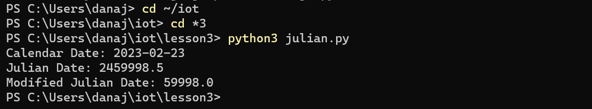

# Lab 3

For this lab, I first installed Python onto my computer to be able to run the commands. 
After downloading Python, I downloaded git, pip, and python. 
Then, I imported the jdcal, astral, and geopy packages so the commands would run. 

$ cd ~/iot changes my directory to Kevin Lu's iot github repository folder.

$ cd *3 changes my directory to the lesson 3 folder within the iot folder.

$ python3 julian.py will output:

$ python3 date_example.py will output:

$ python3 datetime_example.py will output:

$ python3 time_example.py will output:

To run the next command, I needed to download "pytz"

$ python3 sun.py 'New York' will output:

$ python3 moon.py will output:

$ python3 coordinates.py 'SC Williams Library' will output:

$ python3 address.py '40.74480675, -74.02532862031404' will output:

For this next command, I needed to download the package "psutil"

$ python3 cpu.py will output:

$ python3 battery.py will output:

$ python3 documentstats.py document.txt will output:

