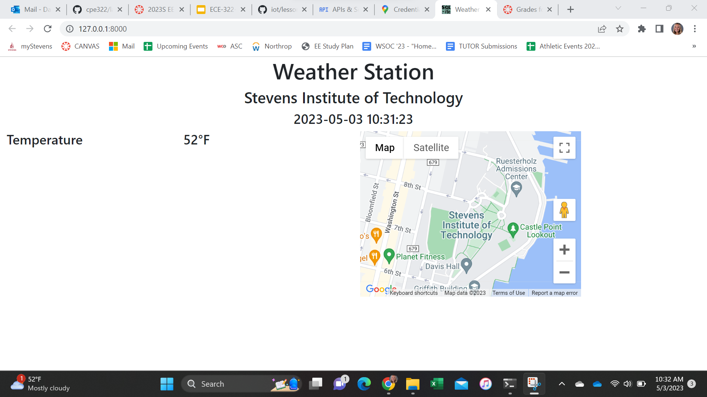
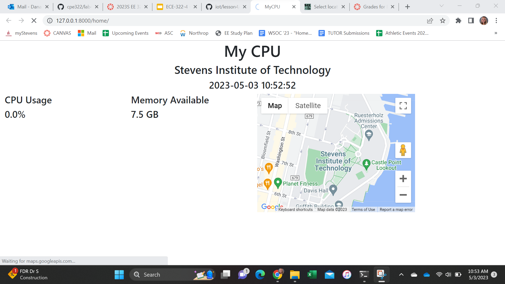
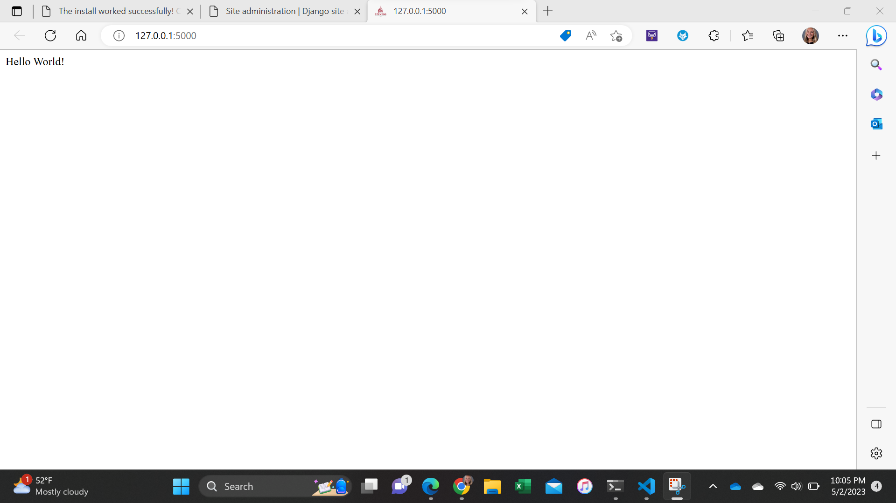

## Lab 4 - Django and Flask

First I installed Django and Django REST framework in the terminal, using the default database, i.e., SQLite.

### Lab 4a
Then I started a Django project "stevens," ran the server, and viewed the app:

### Lab4b
Then I started a Django REST project "mycpu," ran the server, and viewed the app:

### Lab4c 
Then I installed Flask if no module named 'flask' was found, which occurred.
I ran Flask server via hello_world.py and view app:

