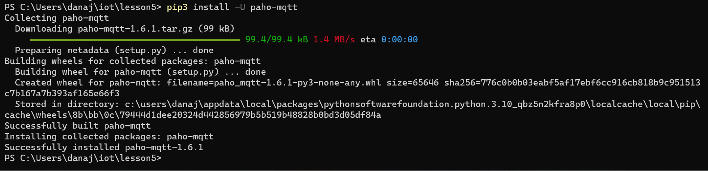
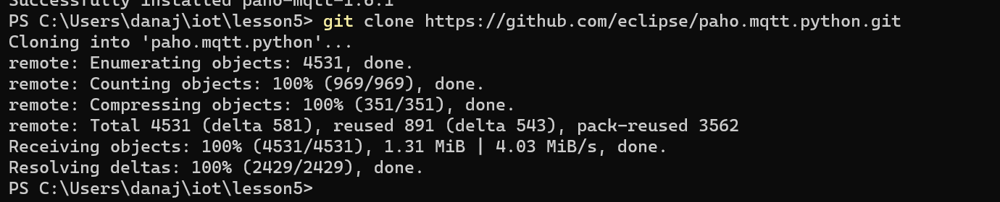
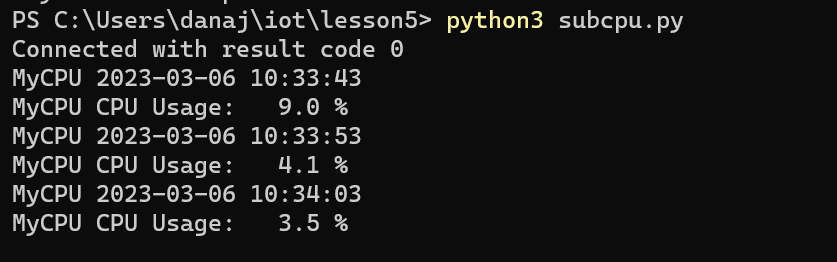
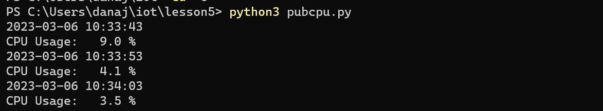

# Lab 5: Paho-MQTT

The first thing I did for Lab 5 was install Paho-MQTT, change the directory to iot repo, then update the repo with git pull, and change the directory to lesson 5.

Then, I ran the codes, subcpu.py and pubcpu.py on seperate terminals and got the following:

###Subcpu.py:

###Pubcpu.py:

