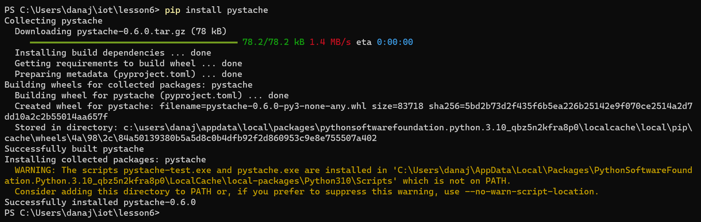
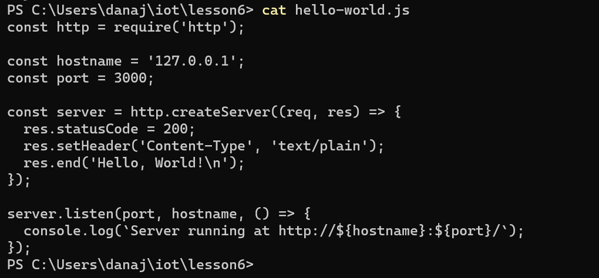
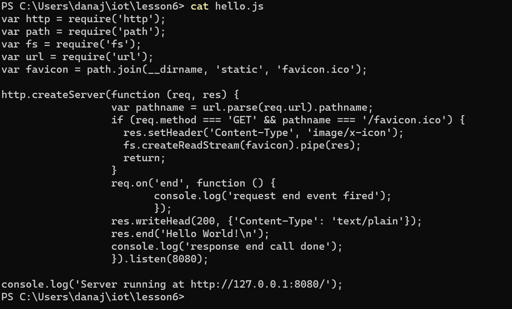
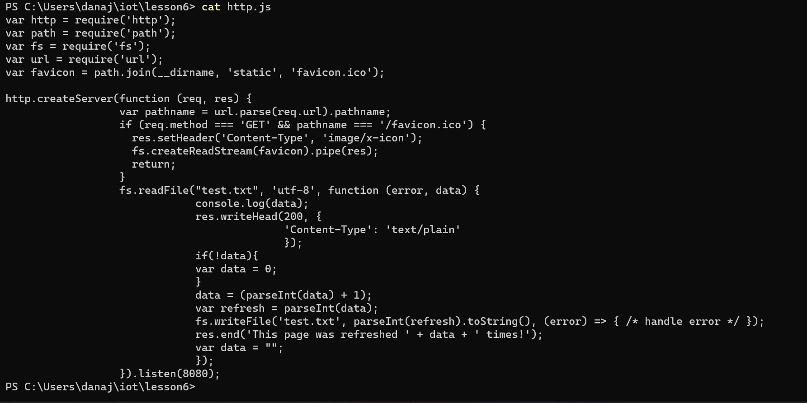
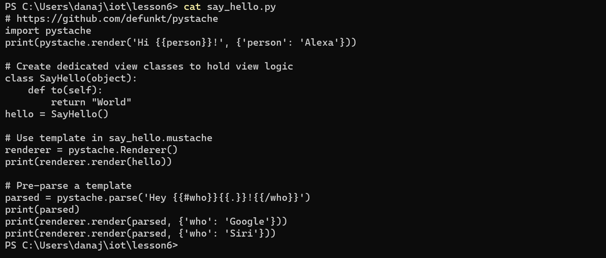
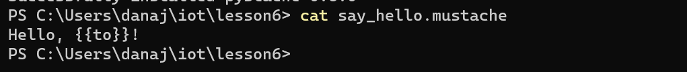
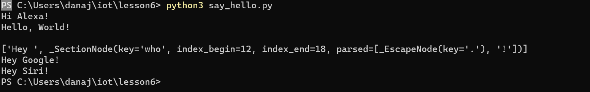

# Lab 6: Node.js and Pystache

The First thing I did for Lab 6 was install Node.js and Pystache. 

I then got myself into the iot folder and then the folder for Lab 6. 

Next I ran the following codes:

Hello-world.js

Hello.js

Http.js

Say_hello.py

Say_hello.mustache

Python3 say_hello.py

