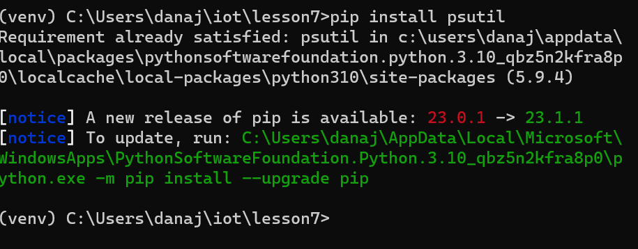
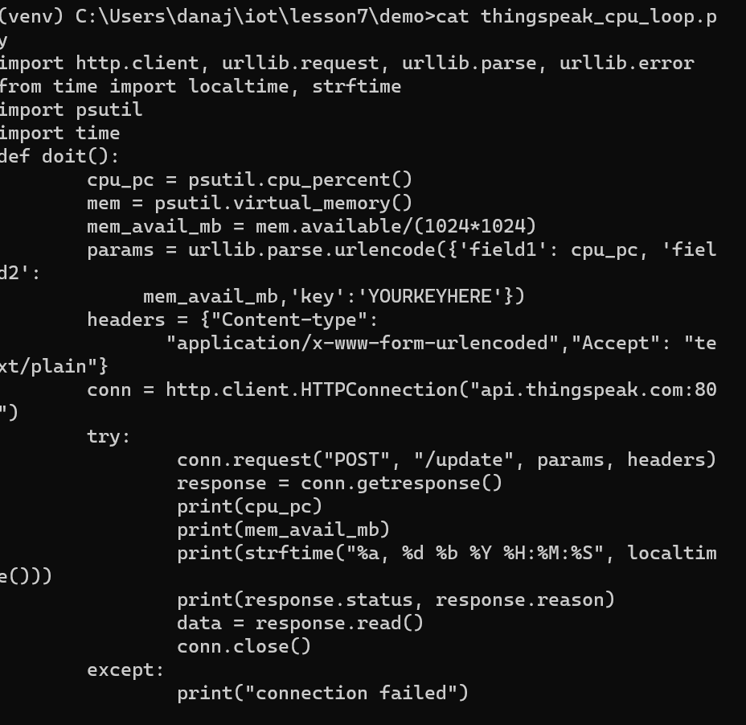
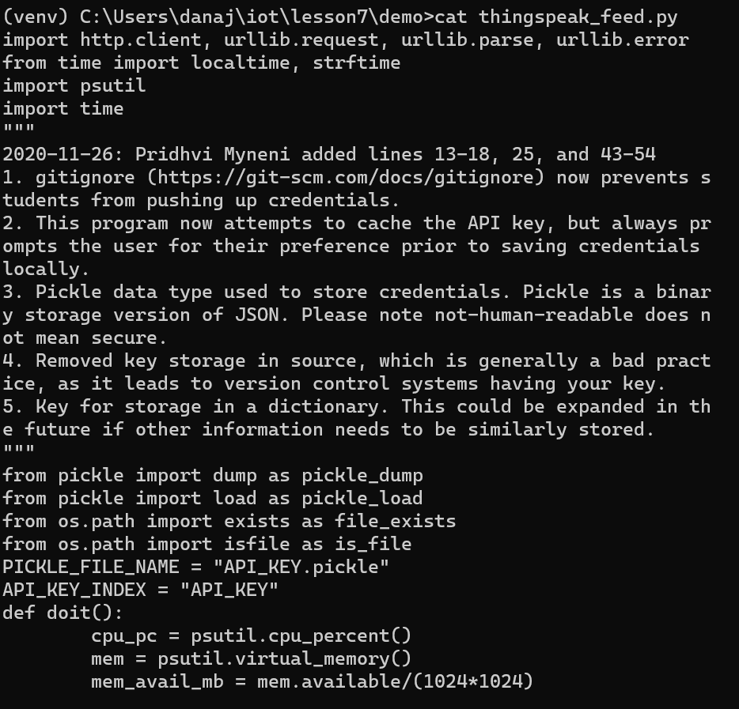
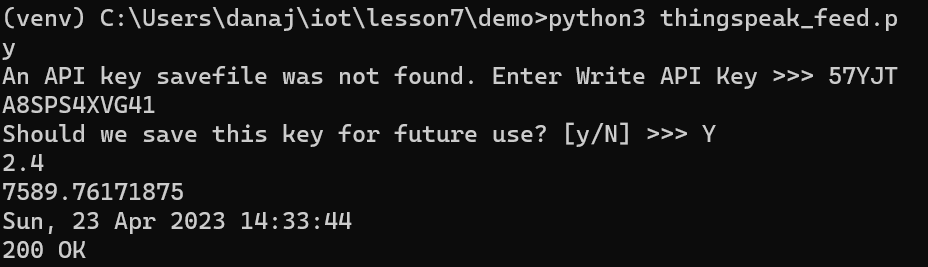
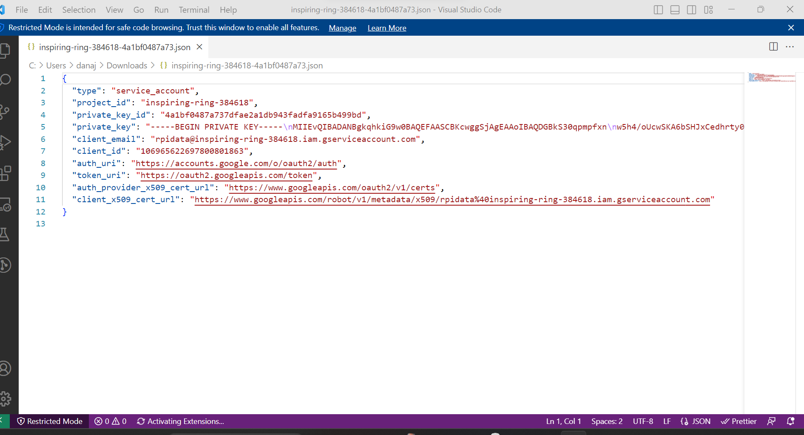
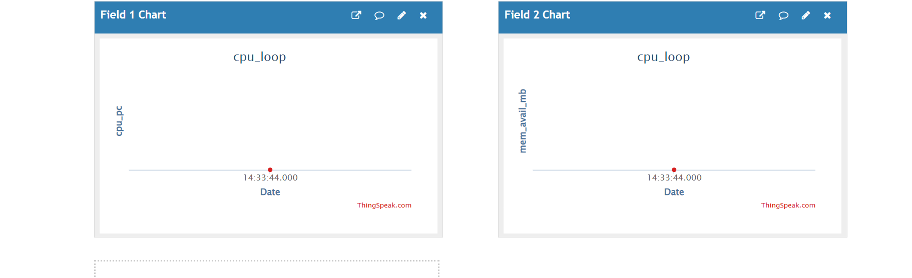
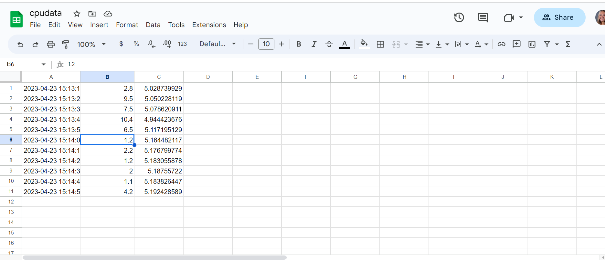

## Lab 7: ThingSpeak and Google Sheets

First, I signed up and logged into MathWorks ThingSpeak.

Then, I ran thingspeak_cpu_loop.py or thinkspeak_feed.py in a demo folder and installed gspread and oauth2client.

Then I logged in the Google Cloud Platform Identity and Access Management, created a project cpudata, enabled both Drive API and Sheets API, created and downloaded service account JSON key file

Next, I started a new Google sheet cpudata, shared it with the client email in the JSON file, deleted Rows 2 to 1000, and edited the header cells

Finally, I ran cpu_spreadsheet.py with the JSON key file in a demo folder and got the following results:

